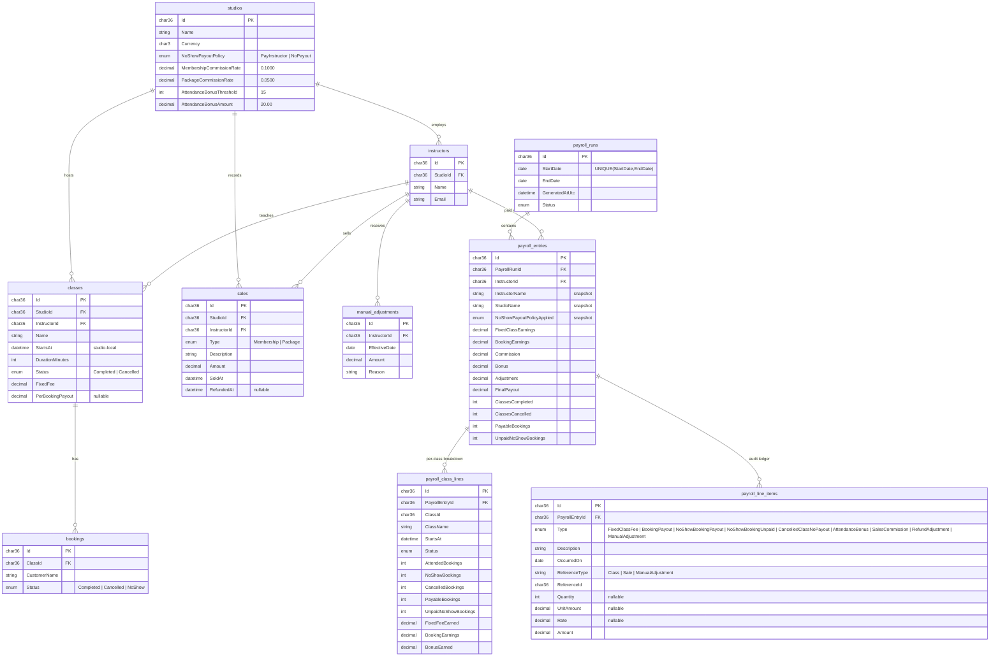

# Rezerv Payroll — Engineering Assessment (Full Stack)

A simplified instructor payroll system for studio businesses: fixed class fees, booking-based payout
with a studio-level no-show policy, attendance bonuses, sales commission with refund reversal, and
manual adjustments — generated per period, stored as an auditable snapshot, and shown in a dashboard.

| Layer    | Stack                                                                   |
| -------- | ----------------------------------------------------------------------- |
| Backend  | .NET 10 · ASP.NET Core Web API · Entity Framework Core 9 · MySQL 8 (Pomelo) · Swagger UI · xUnit |
| Frontend | Next.js 16 (App Router) · React 19 · TypeScript · Tailwind CSS 4 · TanStack Query |
| Infra    | Docker Compose (MySQL + API + Web)                                      |

---

## Table of contents

1. [Quick start](#1-quick-start)
2. [Walkthrough with the sample data](#2-walkthrough-with-the-sample-data)
3. [Architecture](#3-architecture)
4. [Database schema](#4-database-schema)
5. [API](#5-api)
6. [Business rules & assumptions](#6-business-rules--assumptions)
7. [Edge cases](#7-edge-cases)
8. [Refund after payroll has been generated](#8-refund-after-payroll-has-been-generated)
9. [Frontend](#9-frontend)
10. [Tests](#10-tests)
11. [Trade-offs & decisions](#11-trade-offs--decisions)
12. [Scaling and evolving in production](#12-scaling-and-evolving-in-production)
13. [What I'd do with more time](#13-what-id-do-with-more-time)

---

## 1. Quick start

### Option A — Docker Compose (recommended, one command)

```bash
docker compose up --build
```

| Service   | URL                                   |
| --------- | ------------------------------------- |
| Dashboard | http://localhost:3000                 |
| Swagger   | http://localhost:8080/swagger         |
| API       | http://localhost:8080                 |
| MySQL     | `localhost:3307` · `payroll` / `payroll` · db `rezerv_payroll` |

The API applies EF Core migrations and seeds sample data automatically on first start.
`docker compose down -v` resets the database.

### Option B — run locally

Prerequisites: .NET 10 SDK, Node 20+, Docker (for MySQL only) — or any MySQL 8 instance.

```bash
# 1. MySQL
docker run -d --name rezerv-payroll-mysql -p 3307:3306 \
  -e MYSQL_ROOT_PASSWORD=root -e MYSQL_DATABASE=rezerv_payroll \
  -e MYSQL_USER=payroll -e MYSQL_PASSWORD=payroll mysql:8.0

# 2. API  (migrates + seeds on startup; Swagger at http://localhost:5193/swagger)
cd backend
dotnet run --project src/Rezerv.Payroll.Api --urls http://localhost:5193

# 3. Tests
dotnet test

# 4. Web  (http://localhost:3000)
cd ../frontend
cp .env.example .env.local      # NEXT_PUBLIC_API_URL=http://localhost:5193
npm install
npm run dev
```

The connection string lives in `backend/src/Rezerv.Payroll.Api/appsettings.json`
(`ConnectionStrings:Payroll`) and can be overridden with the `ConnectionStrings__Payroll` env var.

To regenerate the migration after a model change:

```bash
cd backend
dotnet ef migrations add <Name> --project src/Rezerv.Payroll.Infrastructure \
  --startup-project src/Rezerv.Payroll.Api --output-dir Persistence/Migrations
```

---

## 2. Walkthrough with the sample data

The seed covers **May – July 2026** and is designed so every rule and edge case in the brief is visible
in a single period: **2026-06-01 → 2026-06-30**.

1. Open the dashboard, set the period to 01 Jun 2026 – 30 Jun 2026 (use `‹` `›` or type it).
2. Click **Generate payroll**.
3. Expected summary (SGD):

| Instructor   | Studio (no-show policy)        | Class earnings | Commission | Bonus | Adjustment | Final payout |
| ------------ | ------------------------------ | -------------: | ---------: | ----: | ---------: | -----------: |
| John Tan     | Flow Yoga (Pay instructor)     |         370.00 |      55.00 | 20.00 |     −30.00 |   **415.00** |
| Sarah Lim    | Flow Yoga (Pay instructor)     |         256.00 |      25.00 |  0.00 |      +7.50 |   **288.50** |
| Mike Chen    | Pulse HIIT (No payout)         |         470.00 |      60.00 | 20.00 |      −6.00 |   **544.00** |
| Aisha Rahman | Pulse HIIT (No payout)         |         408.00 |       0.00 | 20.00 |     −25.00 |   **403.00** |
| Priya Nair   | Flow Yoga                      |  *(no June activity — omitted)* | | | | |

What each row demonstrates:

- **John** — the brief's "pay instructor" example (10 attended + 2 no-show × 10 = 120), a class with
  16 attendees (bonus), a fixed-fee-only class, a **cancelled class with bookings (0 payout)**, a sale
  **refunded in the same period** (+30 / −30 both shown), and a May class that is correctly excluded.
- **Sarah** — a class with **exactly 15 attendees (no bonus — threshold is "exceeds")**, a package
  **sold in May and refunded in June** (−7.50 appears in June only; see §8), and a **manual adjustment** (+15 travel allowance).
- **Mike** — the brief's "no payout" example (10 attended, 2 no-show → 100), unpaid no-shows listed
  explicitly, a cancelled class with 12 bookings, a July class excluded.
- **Aisha** — **booking-only compensation** (no fixed fee), bonus, and a negative manual adjustment (clawback).

4. Click an instructor to open the detail page: per-class breakdown, commission records, refund
   adjustments, bonus records, payout adjustments, and the full **audit ledger** whose line items sum
   exactly to the final payout.
5. Click **Generate payroll** again → the API returns the stored run (`alreadyExisted: true`) and the UI
   offers **Regenerate**. Try 15 Jun – 15 Jul → **409 Conflict** with the overlapping run listed.
6. Try January 2026 → a valid **empty** run (no instructor activity).

---

## 3. Architecture

### Backend — Clean Architecture

```
backend/
├── src/
│   ├── Rezerv.Payroll.Domain/          # Entities, enums, PayrollPeriod value object,
│   │   └── Services/PayrollCalculator  #   and the pure rules engine. No dependencies.
│   ├── Rezerv.Payroll.Application/     # Use cases (PayrollService), DTOs, IPayrollRepository,
│   │                                   #   typed exceptions. Depends only on Domain.
│   ├── Rezerv.Payroll.Infrastructure/  # EF Core DbContext, entity configurations, MySQL provider,
│   │                                   #   migrations, repository implementation, seeder.
│   └── Rezerv.Payroll.Api/             # Controllers, Swagger, ProblemDetails exception handler,
│                                       #   CORS, DI composition root.
└── tests/
    └── Rezerv.Payroll.Tests/           # xUnit: 36 tests over the calculator and the service.
```

Dependency direction is strictly inward: `Api → Infrastructure → Application → Domain`.
The Application layer never references EF Core; Infrastructure implements `IPayrollRepository`.

**Request flow for `POST /api/payroll/generate`:**

```
Controller
  └─ PayrollService.GenerateAsync
       ├─ validate period (end ≥ start, ≤ 366 days)
       ├─ identical run exists?  → return it (idempotent)       ─┐
       ├─ overlapping run exists? → 409                           │ guards
       ├─ load instructors, classes(+bookings), sales, adjustments│ (4 queries total, not N+1)
       ├─ for each instructor: PayrollCalculator.Calculate(...)   │ pure, in-memory
       │     → PayrollEntry { totals, ClassLines[], LineItems[] } │
       └─ persist PayrollRun snapshot (unique index on period)   ─┘
```

**Key design choice — payroll is a stored snapshot, not a live query.**
`GET /api/payroll` reads the persisted `PayrollRun`; it does not recompute. Payroll is money that
gets paid out; the numbers an admin approved must not silently change when a booking is edited a
week later. Corrections are explicit (`regenerate: true`) and future-period adjustments (refunds)
flow into the period in which they happen.

**`PayrollCalculator` is a pure domain service.** It takes an instructor, their studio's rules and
plain collections, and returns a fully explained `PayrollEntry`. No I/O, no clock, no DB — which is
why it has exhaustive unit tests and why the service layer stays thin.

**Every cent is explained.** Each entry carries an **audit ledger** (`PayrollLineItem[]`) — one row per
fee, per booking group, per bonus, per commission, per refund, per manual adjustment — plus
informational zero-amount rows (unpaid no-shows, cancelled classes) so an auditor can see what was
*considered* and not paid. Entry totals are denormalised from the ledger for cheap summary queries;
tests assert the two always agree.

### Frontend

```
frontend/src/
├── app/                    # Next.js App Router (thin server shells + Suspense)
│   ├── page.tsx            #   /                         → Dashboard
│   └── instructors/[instructorId]/page.tsx              → InstructorDetail
├── features/payroll/
│   ├── Dashboard.tsx       # Period in URL, generate flow, 409/idempotent handling
│   ├── PeriodFilter.tsx    # Date inputs, ‹ › month nav, quick-select, generated-run chips
│   ├── PayrollSummaryTable.tsx  # Sortable table (desktop) / cards (mobile), loading/empty/error, totals row
│   ├── InstructorDetail.tsx     # Totals, classes, commissions, refunds, bonuses, adjustments, ledger
│   └── hooks.ts            # TanStack Query hooks + cache keys
├── lib/                    # Typed API client (ProblemDetails-aware), DTO types, formatting, period math
└── components/             # Small UI primitives (Alert, Card, Button, Skeleton, SortableHeader, Money)
```

State management: **TanStack Query** for server state (caching, loading/error states, invalidation
after generate) + **URL search params** for the selected period (shareable links, survives refresh,
back button works) + local `useState` for sort order. No global store is needed for this scope.

---

## 4. Database schema



Notes:

- **Source tables** (`studios`…`manual_adjustments`) model what the wider Rezerv platform would own.
  **Payroll tables** (`payroll_*`) are the immutable output of a run.
- Payroll rules (`NoShowPayoutPolicy`, commission rates, bonus threshold/amount) are **per studio**,
  because the brief says "studios can configure" and Rezerv is multi-tenant. Two seeded studios use
  different no-show policies.
- Compensation terms (`FixedFee`, `PerBookingPayout`) sit **on the class** — a snapshot of what was
  agreed when the class was scheduled — so changing a template later doesn't rewrite history.
- Money is `decimal(12,2)`; rates `decimal(5,4)`; enums are stored as strings (payroll data is read by
  humans and auditors). Indexes support the generation queries (`(InstructorId, StartsAt)`,
  `(InstructorId, SoldAt)`, `RefundedAt`, `(ClassId, Status)`).
- The **unique index on `(StartDate, EndDate)`** is the final arbiter of idempotency under concurrency.
- The migration is in `backend/src/Rezerv.Payroll.Infrastructure/Persistence/Migrations/`.

---

## 5. API

Swagger UI: `/swagger`. All errors are RFC 7807 `application/problem+json`.

| Method | Path | Purpose |
| ------ | ---- | ------- |
| `POST` | `/api/payroll/generate` | Generate payroll for all instructors for a period |
| `GET`  | `/api/payroll?startDate&endDate` | Summary rows for a generated period (`[]` if none) |
| `GET`  | `/api/payroll/{instructorId}?startDate&endDate` | Full breakdown for one instructor |
| `GET`  | `/api/payroll/runs` | List generated runs (convenience for the dashboard) |
| `GET`  | `/health` | Liveness |

### `POST /api/payroll/generate`

```jsonc
// request
{ "startDate": "2026-06-01", "endDate": "2026-06-30", "regenerate": false }

// 201 Created  (or 200 OK when alreadyExisted = true)
{
  "run": { "id": "…", "startDate": "2026-06-01", "endDate": "2026-06-30",
           "generatedAtUtc": "…", "status": "Generated", "instructorCount": 4, "totalPayout": 1650.50 },
  "alreadyExisted": false,
  "regenerated": false,
  "summary": [ /* same shape as GET /api/payroll */ ]
}
```

| Status | When |
| ------ | ---- |
| `201`  | New run created (including an empty one for a period with no activity) |
| `200`  | Identical period already generated → existing run returned, nothing recalculated |
| `400`  | `endDate < startDate`, period > 366 days, malformed dates |
| `409`  | Period **overlaps** a different existing run (`conflictingPeriods` listed), or a concurrent request won the race |

### `GET /api/payroll` — summary row

Field names follow the brief's sample; extra fields are additive.

```jsonc
{
  "instructorId": "10000000-0000-0000-0000-000000000001",
  "instructorName": "John Tan", "studioName": "Flow Yoga Studio", "currency": "SGD",
  "fixedClassEarnings": 90.00, "bookingEarnings": 280.00,
  "classEarnings": 370.00,          // fixed + booking (the brief's column)
  "commission": 55.00, "bonus": 20.00, "adjustment": -30.00,
  "finalPayout": 415.00,
  "classesCompleted": 3, "payableBookings": 28, "unpaidNoShowBookings": 0
}
```

### `GET /api/payroll/{instructorId}` — detail

Returns `totals`, counts, and five typed sections — `classes[]`, `commissions[]`, `refundAdjustments[]`,
`bonuses[]`, `payoutAdjustments[]` — plus `lineItems[]`, the raw audit ledger. `404` if no payroll was
generated for the period or the instructor had no activity in it.

Seeded instructor IDs: John `…0001`, Sarah `…0002`, Mike `…0003`, Aisha `…0004`, Priya `…0005`
(prefix `10000000-0000-0000-0000-00000000`).

---

## 6. Business rules & assumptions

The brief leaves several things open. Here is each decision and why.

| # | Rule / assumption | Reasoning |
| - | ----------------- | --------- |
| 1 | **Period is inclusive on both ends**, compared on the *date* part of the class start / sale / refund timestamp. | Matches the brief's `2026-06-01 → 2026-06-30` example and how payroll periods are described in practice. |
| 2 | **Fixed fee is paid once per completed class.** Cancelled classes pay nothing, even if they had bookings or a fee. | Explicit in the brief. |
| 3 | **A class may have a fixed fee, a per-booking payout, both, or neither** (`PerBookingPayout` nullable). | "A class may contain multiple compensation models… may apply together." |
| 4 | **Cancelled bookings never count** — not for payout, not for attendance. | Explicit in the brief. |
| 5 | **No-shows** earn payout only when the studio policy is `PayInstructor`; under `NoPayout` they are recorded as *unpaid no-show bookings* (zero-amount ledger line) so the breakdown shows them. | Brief requires the breakdown to show "unpaid no-show bookings". |
| 6 | **Attendance for the bonus = bookings with status `Completed`** (attended). No-shows didn't attend, so they don't count. | The brief says "attendance" and "exclude cancelled"; counting people who weren't in the room as attendance would be surprising. Documented because the brief is silent on no-shows here. |
| 7 | **Bonus requires attendance strictly greater than the threshold** (16+ for threshold 15). | "exceeds 15". Tested at 14/15/16. |
| 8 | **Bonus is separate from class earnings** in both the summary and the detail. | Brief: "Bonus should appear separately". |
| 9 | **Commission is earned in the period of `SoldAt`**; **refund reversal is booked in the period of `RefundedAt`**. If both fall in the same period, both lines appear and net to zero. | Keeps closed payroll immutable while still clawing back — see §8. |
| 10 | **Commission rounds to cents** (`MidpointRounding.ToEven`) per sale. | Avoids fractional-cent drift across many small sales. |
| 11 | **`adjustment` = refund reversals + manual adjustments.** The detail splits them: `refundAdjustments` (refunds only) and `payoutAdjustments` (everything in the adjustment total). | The brief lists "Refund adjustments" and "Payout adjustments" as separate detail sections; manual adjustments give the second one a real meaning (travel allowance, clawback). |
| 12 | **Payroll rules are per studio**, snapshotted onto the entry (`NoShowPayoutPolicyApplied`, names, currency). | Multi-tenant platform; a policy change next quarter must not alter last quarter's stored payroll. |
| 13 | **Instructors with zero activity in the period are omitted** from the run; a period with no activity at all yields a valid run with zero entries → `GET` returns `[]`. | Brief: "Empty payroll periods should return valid empty results." Showing every instructor with 0.00 would be noise for a 200-instructor studio. |
| 14 | **Negative final payout is allowed** (e.g. a refund reversal in a month with no classes). | It's a genuine clawback; the business must decide whether to net it against the next period or invoice. Flagged rather than hidden. |
| 15 | Timestamps are **studio-local** (`datetime(6)`), no time-zone conversion. | Single-region simplification; see §12 for the production approach. |
| 16 | Payroll generation covers **all studios/instructors** in one run. | Brief: "Generate payroll for all instructors." In production this would be per studio (see §12). |

---

## 7. Edge cases

| Edge case (from the brief) | How it's handled | Where tested |
| -------------------------- | ---------------- | ------------ |
| Refunded sales | Negative `RefundAdjustment` ledger line in the refund's period; original commission untouched. Same-period refund shows both lines. | `Refund_InSamePeriod…`, `Refund_AfterPayrollPeriodClosed…` |
| Cancelled class | Zero payout, zero bonus; still listed as a `PayrollClassLine` + `CancelledClassNoPayout` ledger line for audit. | `CancelledClass_GeneratesNoPayout…`, `AttendanceBonus_NotPaidForCancelledClass` |
| No-show bookings | Policy-dependent: paid (`NoShowBookingPayout`) or explicitly unpaid (`NoShowBookingUnpaid`, amount 0, quantity shown). | `NoShowPolicy_PayInstructor…`, `NoShowPolicy_NoPayout…` |
| Attendance bonus threshold | Strictly greater; attended-only count; completed classes only. | `AttendanceBonus_AppliesOnlyAboveThreshold` (14/15/16/30), `…ExcludesCancelledAndNoShow…` |
| Multiple earning sources | Summed per instructor; ledger sum == final payout; class lines agree with totals. | `MultipleEarningSources_CombineCorrectly…` |
| Duplicate payroll generation | Identical period → idempotent 200 with the stored run. Different-but-overlapping period → 409. DB unique index catches concurrent races → 409. Explicit `regenerate: true` to replace. | `Generate_SamePeriodTwice_IsIdempotent`, `…Overlapping…`, `…Regenerate…`, `…AdjacentPeriods…` |
| Empty payroll period | Valid run with zero entries; `GET` returns `[]`; UI shows a specific empty state. | `Generate_EmptyPeriod_ReturnsValidEmptyRun`, `GetSummary_BeforeGeneration…` |
| Invalid period | `400` for `end < start` or > 366 days; the UI validates the same rules before calling. | `Generate_RejectsInvalidPeriods` |
| Out-of-period records | Classes/sales/adjustments outside the range are ignored (seed includes May and July records). | `Period_IsInclusiveOnBothEnds…` |
| Host locale | All formatting/parsing uses `InvariantCulture`. (Found during testing: on a Thai-locale machine, .NET's default calendar printed Buddhist-era years like `2569-06-15`.) | — |

---

## 8. Refund after payroll has been generated

> *"A refunded sale may occur after payroll has already been generated. Please document how your
> solution would handle this scenario."*

**Implemented behaviour.** Commission is recognised in the period the sale was made; the reversal is
recognised in the period the refund was issued. So:

```
May payroll  (generated 1 Jun, already paid):  Sarah  +7.50  commission on 5-Class Pack
8 Jun:       customer refunded
June payroll (generated 1 Jul):                Sarah  −7.50  RefundAdjustment "reversal of 5% commission (sold 2026-05-20)"
```

The May run is never touched. The June ledger line references the original `SaleId`, the sale date
and the rate, so the auditor can trace the reversal back. The seed contains exactly this case (Sarah,
sale `…0004`).

**Why this approach.**

- *Immutability.* A generated payroll is a financial record that may have been exported to a payment
  provider or accounting system. Mutating it retroactively breaks reconciliation.
- *Natural fit.* It's the same mechanism as a manual adjustment: an event with an effective date flows
  into whichever period contains that date. No special "re-open" workflow.
- *Visibility.* The admin sees the clawback as a distinct, signed line in the current period rather
  than a silently smaller number in an old one.

**Alternatives considered.**

| Approach | Pros | Cons |
| -------- | ---- | ---- |
| Reverse in the refund period *(chosen)* | Immutable history, simple, auditable | A refund can make a quiet month's payout negative (see assumption 14) |
| Reopen & regenerate the original period | Original period "looks right" | Rewrites paid history; cascading corrections if the instructor was already paid |
| Pending/approved run states + delta runs | Most rigorous for large orgs | Significant extra workflow for this scope |

**What a production version would add.**

- `PayrollRun.Status` lifecycle: `Draft → Approved → Paid`. Refunds against a *Paid* run create a
  reversal in the next open period (as now); refunds against a *Draft* run simply regenerate it.
- A **domain event** `SaleRefunded` so payroll doesn't have to scan `RefundedAt`; it would append a
  `PendingAdjustment` row that the next generation picks up — making the calculation incremental
  and making "what adjustments are waiting for the next run?" a direct query.
- A **negative-payout policy** per studio: carry forward to the next period, net against a floor of
  zero, or invoice the instructor.

---

## 9. Frontend

Requirements from the brief and where they live:

| Requirement | Implementation |
| ----------- | -------------- |
| Period filter (start / end) → generate | `PeriodFilter`: native date inputs, `‹ ›` to step a month (or the period's own length), "This month / Last month", and chips for already-generated runs. Validates the same rules as the API before submitting. |
| Summary table columns | Instructor · Class earnings · Commission · Bonus · Adjustment · Final payout (+ studio, class count, unpaid no-shows as a sub-line; totals footer). |
| Loading state | Skeleton rows while fetching; button shows a spinner and "Generating…". |
| Empty state | Two distinct messages: *no payroll generated yet* vs *generated but no activity*. |
| Error handling | ProblemDetails-aware `ApiError`; banners for 400/409/500 and network failure. The 409 banner offers **"Open ‹conflicting period›"** buttons; the idempotent 200 offers **Regenerate** with an inline confirmation. |
| Sorting | All six columns sortable (names A→Z by default, money columns largest-first); mobile exposes Name / Final payout. Stable secondary sort by name. |
| Detail view | Separate page `/instructors/{id}?startDate&endDate` (shareable). Totals cards, per-class table, commissions, refund adjustments, bonuses, payout adjustments, collapsible audit ledger with a reconciliation check. |
| Responsive | Table on `md+`; stacked cards with their own sort control below. Filter grid collapses to one column. |
| TypeScript | Strict; DTO types mirror the backend records. |

Period state is kept in the **URL**, so a reviewer can bookmark `/?startDate=2026-06-01&endDate=2026-06-30`.

---

## 10. Tests

```bash
cd backend && dotnet test
# Passed! - Failed: 0, Passed: 36, Skipped: 0
```

- **`PayrollCalculatorTests` (25 cases)** — every rule in §6 and every edge case in §7, including the brief's
  worked examples (120 vs 100, 10% / 5%, bonus at 14/15/16), period boundaries, rounding, and the
  invariant *sum(ledger) == finalPayout == sum(class lines) + commission + adjustments*.
- **`PayrollServiceTests` (11 cases)** — idempotency, overlap rejection, adjacent periods allowed,
  regenerate picks up corrected data, empty periods, inactive instructors omitted, validation, 404
  semantics — against an in-memory `IPayrollRepository` fake and a `FakeTimeProvider`.

The API was additionally exercised end-to-end against MySQL (all status codes in §5) and the UI was
checked in a browser at desktop and 390 px widths, both locally and via `docker compose`.

---

## 11. Trade-offs & decisions

| Decision | Alternative | Why this way |
| -------- | ----------- | ------------ |
| **Snapshot payroll** in `payroll_*` tables | Compute on every `GET` | Payroll must be stable and auditable once generated; recomputing on read would silently change paid numbers. Costs a few tables and an explicit `regenerate` path. |
| **Reject overlapping periods (409)** | Allow and warn | Paying the same class twice is the worst payroll bug; a hard stop with a clear message and an "open the existing run" affordance is safer. Adjacent periods are fine. |
| **Omit zero-activity instructors** | Row per instructor with 0.00 | Cleaner for large studios; the brief asks for *empty* results for empty periods. Easy to flip. |
| **Attendance = Completed bookings only** | Include no-shows | "Attendance" means attended; documented because the brief is silent. One-line change in `PayrollCalculator`. |
| **Compensation terms on the class** | Separate `ClassType`/rate-card table | Snapshot semantics for free and fewer joins; a rate card can be layered on top later (see §12). |
| **Studio-level rules** (policy, rates, threshold) | Hard-coded constants | The brief says *studios can configure*; parameterising costs nothing and lets the seed prove both no-show branches. |
| **Audit ledger + denormalised totals** | Totals only | The brief stresses auditability; the ledger gives a line-by-line explanation and lets tests prove reconciliation. Totals are kept so the summary is a single-table read. |
| **Guid primary keys, deterministic seed IDs** | Auto-increment ints | Safe to generate client-side/offline and to merge across tenants; fixed seed IDs make the README and curl examples reproducible. |
| **EF Core 9 + Pomelo** on .NET 10 | Oracle's `MySql.EntityFrameworkCore` | Pomelo is the de-facto provider; 9.0.0 is its latest stable and runs fine on the .NET 10 runtime. Pinned server version so migrations build without a DB. |
| **Migrations applied on startup** | Separate migration step | Zero-friction for reviewers; in production this becomes a deploy step (see §12). |
| **TanStack Query + URL state** | Redux/Zustand | Server-state caching and request lifecycle are the actual problem here; a global store would add ceremony without benefit. |
| **Client-rendered dashboard** behind `Suspense` | RSC data fetching | The API is a separate service and the page is interactive (sorting, generate); client fetching with a typed client is simpler and avoids coupling the Next server to the API. |
| **Enums stored as strings** | Ints | Payroll tables are read by people; `'NoPayout'` beats `2`. |

---

## 12. Scaling and evolving in production

**Tenancy & scope.** Generation would be **per studio** (`POST /api/studios/{id}/payroll/generate`),
with the unique key becoming `(StudioId, StartDate, EndDate)`. Row-level tenant filtering via a
global query filter on `StudioId`. Authentication/authorisation (studio admin vs instructor viewing
their own payslip) is out of scope here but slots into the Api layer.

**Volume.** Generation is already O(records in period) with four set-based queries, no N+1. For very
large studios: stream classes per instructor, or shard the run into per-instructor jobs on a queue
(each `PayrollEntry` is independent). Summary reads hit `payroll_entries` only; detail reads are
bounded by one instructor's period.

**Async generation.** Move `generate` to `202 Accepted` + a background worker (Hangfire / a queue),
with `PayrollRun.Status = Pending → Generated → Failed`. The frontend already models the run list, so
it would poll `/runs` or subscribe to a notification.

**Run lifecycle.** `Draft → Approved → Paid` with approver, timestamps and an export to the payment
provider. Only *Draft* can be regenerated; *Paid* is immutable and corrections become adjustments in
the next period (as refunds already do). Soft-delete superseded runs instead of deleting, keeping the
full history of what was shown to whom.

**Event-driven adjustments.** Emit `SaleRefunded`, `BookingStatusChanged`, `ClassCancelled` events
that enqueue `PendingAdjustment` rows; generation consumes them. This removes the `RefundedAt` scan,
makes late booking edits after payroll visible, and gives a direct "pending for next run" view.

**Rate cards.** Introduce `CompensationPlan` (per instructor or per class type, effective-dated) so
scheduling resolves fees automatically while classes keep the snapshot copy they have today.

**Time zones.** Store instants in UTC plus a studio IANA time zone; compute "period membership" in
studio-local time at generation. Classes near midnight at month end are the classic bug.

**Observability.** Structured logs with `RunId`/`StudioId`, metrics on generation duration and run
counts, and an **invariant check** at the end of generation (`sum(ledger) == finalPayout`) that fails
loudly rather than persisting a bad run.

**API hygiene.** Versioned routes (`/api/v1`), pagination on `/runs` and the summary for very large
studios, ETags on detail responses (snapshots make them trivially cacheable), rate limiting on
`generate`.

**Data integrity.** Database-level `CHECK` constraints on non-negative counts, and an idempotency key
header on `generate` for clients that retry blindly.

---

## 13. What I'd do with more time

- Integration tests with Testcontainers (real MySQL) around `EfPayrollRepository` and the unique-index race.
- Frontend component tests (Vitest + Testing Library) for `PeriodFilter` validation and table sorting.
- Export (CSV / payslip PDF) per instructor from the detail view.
- A tiny admin page to flip a studio's no-show policy and see the next generation change — the backend
  already supports it.
- GitHub Actions: `dotnet test`, `npm run lint && npm run build`, and `docker compose build`.
